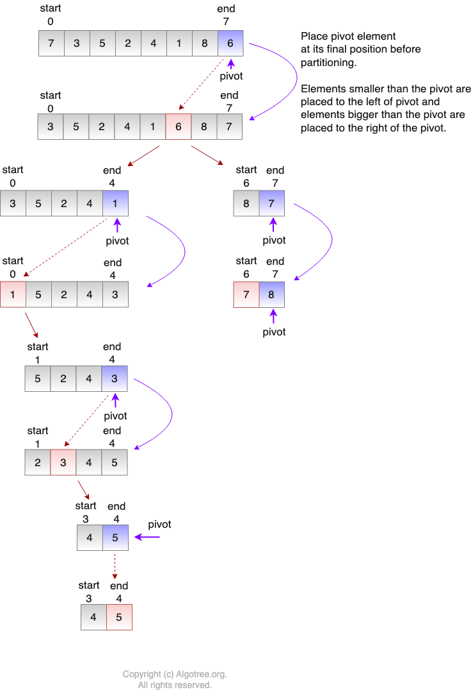

#  Understanding QuickSort

# Introduction

In this lesson, students will master QuickSort, a highly efficient sorting algorithm that uses the divide and conquer method. By understanding and implementing QuickSort, students will learn about the optimality of efficiency in sorting algorithms and the intricacies of time and space complexity associated with QuickSort.

## Learning Objectives

By the end of this lesson, students will be able to:

- Comprehend the divide and conquer strategy used by QuickSort to partition arrays around a pivot element and recursively sort the partitions.
- Assess the time complexities of QuickSort in best, average, and worst-case scenarios, and understand the space complexity implications of recursive sorting.
- Explore optimization techniques such as randomized pivot selection and tail recursion to enhance QuickSort’s efficiency and minimize resource usage.

## Course Overview (30min)

1. [Introduction to QuickSort](#introduction-to-quicksort)
    - [How QuickSort Works](#how-quicksort-works)
    - [Time and Space Complexity](#time-and-space-complexity)
    - [Optimizations and Practical Considerations](#optimizations-and-practical-considerations)
2. [Implementation in Java](#implementation-in-java)
    - [QuickSort Definition](#quicksort-definition)
    - [Usage Example](#usage-example)
3. [Summary and Key Takeaways](#summary-and-key-takeaways)

## Introduction to QuickSort

QuickSort is a sorting algorithm that efficiently organizes elements within an array using the divide and conquer
method. The process begins by partitioning the array into two sub-arrays based on a pivot element, which is typically
chosen as the last element in the array. This pivot is then correctly positioned in its final location within the sorted
array. Elements smaller than the pivot are arranged to its left, while those larger are positioned to its right. This
partitioning process is repeated recursively for each sub-array, ensuring that each pivot element is securely placed at
its correct location. The procedure continues until the entire array is sorted, with each element in its proper place.

### How QuickSort Works

1. Select the last element of the array as the pivot.
2. Ensure the pivot is moved to its correct position such that all elements to its left are smaller, and all elements to
   its right are larger.
3. Partition the array around the pivot:
    - Partition A: Starts from the beginning of the array and ends just before the pivot.
    - Partition B: Starts immediately after the pivot and continues to the end of the array.
4. Recursively apply the above steps to both Partition A and Partition B until the entire array is sorted.



### Time and Space Complexity

Understanding the time and space complexity of QuickSort is crucial for analyzing its efficiency and suitability for
different datasets and environments. Below, we delve into the intricacies of these complexities.

#### Time Complexity

QuickSort's performance heavily depends on the choice of the pivot and the distribution of the array's elements. The
time complexity varies based on the best, average, and worst-case scenarios:

- **Best Case**:
    - **Scenario**: The best case occurs when the pivot divides the array into two nearly equal parts at every recursive
      step.
    - **Complexity**: \(O(n \log n)\)
    - **Details**: This ideal partitioning results in each level of recursion involving \(O(n)\) operations, with the
      depth of the recursion tree being \(\log n\).
- **Average Case**:
    - **Scenario**: Typical for randomly ordered data where the partitions are reasonably balanced.
    - **Complexity**: \(O(n \log n)\)
    - **Details**: Assumes that the splits do not vary significantly from one recursive call to another, maintaining
      balanced work across the recursive tree.
- **Worst Case**:
    - **Scenario**: Occurs when the pivot is the smallest or largest element in the array.
    - **Complexity**: \(O(n^2)\)
    - **Details**: Each level of recursion operates over nearly the entire array, with the depth of the recursion
      reaching \(n\), leading to significantly increased processing time due to highly unbalanced partitions.

#### Space Complexity of QuickSort

QuickSort is a recursive algorithm, and its space complexity largely depends on the depth of the recursion stack used
during its execution.

- **In-Place Sorting**:
    - QuickSort is considered an in-place sorting algorithm, which means it doesn't require additional storage
      proportional to the element count. However, it does utilize space on the stack for recursive calls.
- **Worst Case**:
    - In the worst case scenario, where the pivot choices are consistently poor (usually the smallest or largest
      element), the depth of the recursion tree can reach \(n\). This results in QuickSort requiring \(O(n)\) space on
      the stack.
- **Best and Average Case**:
    - With better pivot choices, typically either optimal or good enough, the recursion depth generally remains around
      \(\log n\). Consequently, the space complexity in these cases is reduced to \(O(\log n)\).

#### Optimizations and Practical Considerations

To address the potential worst-case scenario of \(O(n^2)\) time complexity in QuickSort, several effective strategies
are implemented:

- **Pivot Selection**:
    - **Strategy**: Employing randomized pivot selection helps achieve a more balanced partition on average.
    - **Benefit**: This approach ensures performance that is consistently closer to \(O(n \log n)\), by preventing the
      algorithm from degrading due to poor pivot choices.
- **Tail Recursion**:
    - **Strategy**: Implementing tail recursion optimizations can significantly reduce space complexity.
    - **Benefit**: This is achieved by converting some recursive calls into iterations, which minimizes the use of stack
      space.

Understanding these optimizations and their implications is crucial for effectively choosing and implementing QuickSort
based on the specific characteristics of the data and the constraints of the computational environment.

## Implementation in Java

Here’s what the implementation of a QuickSort looks like in Java:

### Selection QuickSort Definition

```java
public class DivideAndConquerQuickSort {
    int Partition(int[] array, int start, int end) {
        int pivot = array[end];
        int j = start;
        // Keep placing elements less than the pivot element to the left
        for (int i = start; i < end; i++) {
            if (array[i] < pivot) {
                // Swap array[i] with array[j]
                int tmp = array[i];
                array[i] = array[j];
                array[j] = tmp;
                j++;
            }
        }

        // Place the pivot i.e array[end] at its final position and return the pivot index
        // for partitioning the array
        int tmp = array[j];
        array[j] = array[end];
        array[end] = tmp;

        return j;
    }

    void QuickSort(int[] array, int start, int end) {
        int p;

        if (start < end) {
            p = Partition(array, start, end);
            QuickSort(array, start, p - 1);
            QuickSort(array, p + 1, end);
        }
    }
}
```

### Usage Example

```java
public class QuickSortDemo {
    public static void main(String[] args) {

        int[] array = {7, 3, 5, 2, 4, 1, 8, 6, 0, 10, 9};

        System.out.print("Unsorted array : ");

        for (int j : array) System.out.print(j + " ");
        System.out.println();

        DivideAndConquerQuickSort divideAndConquerQuickSort = new DivideAndConquerQuickSort();
        divideAndConquerQuickSort.QuickSort(array, 0, array.length - 1);
        System.out.print("Sorted array using Quick Sort : ");

        for (int j : array) System.out.print(j + " ");
    }
}
```

## Summary and Key Takeaways

QuickSort is a highly efficient sorting algorithm that utilizes the divide and conquer strategy to sort elements within
an array. Its performance is significantly influenced by the choice of the pivot element and the partitioning strategy
used. Here are the key takeaways from the discussion on QuickSort:

1. **Divide and Conquer**: QuickSort partitions the array around a pivot element, sorting the elements to the left and
   right of the pivot recursively.
2. **Pivot Selection**: The choice of pivot is critical for achieving balanced partitions, which directly impacts the
   efficiency of the sort. Randomized pivot selection is recommended to avoid the algorithm's degradation in performance
   in the worst-case scenario.
3. **Time Complexity**:
    - Best and Average Cases: \(O(n \log n)\), achieved under balanced partition conditions.
    - Worst Case: \(O(n^2)\), occurs when the partitions are extremely unbalanced, typically when the pivot is the
      smallest or largest element.
4. **Space Complexity**: While QuickSort is an in-place sort (not requiring additional space proportional to the number
   of elements), it uses \(O(\log n)\) space in the best and average cases due to recursion. In the worst case, it can
   use up to \(O(n)\) space.
5. **Optimizations**:
    - **Randomized Pivot Selection**: Helps in maintaining balanced partitions and consistent performance.
    - **Tail Recursion**: Optimizes space usage by minimizing the depth of the recursion stack.
6. **Practical Considerations**: Understanding the time and space complexities, along with strategic optimizations,
   allows for better decision-making when implementing QuickSort, particularly in choosing it over other sorting
   algorithms based on the dataset's characteristics and computational environment constraints.

By adhering to these principles and considerations, QuickSort can be effectively utilized to achieve optimal sorting
performance in various applications.

